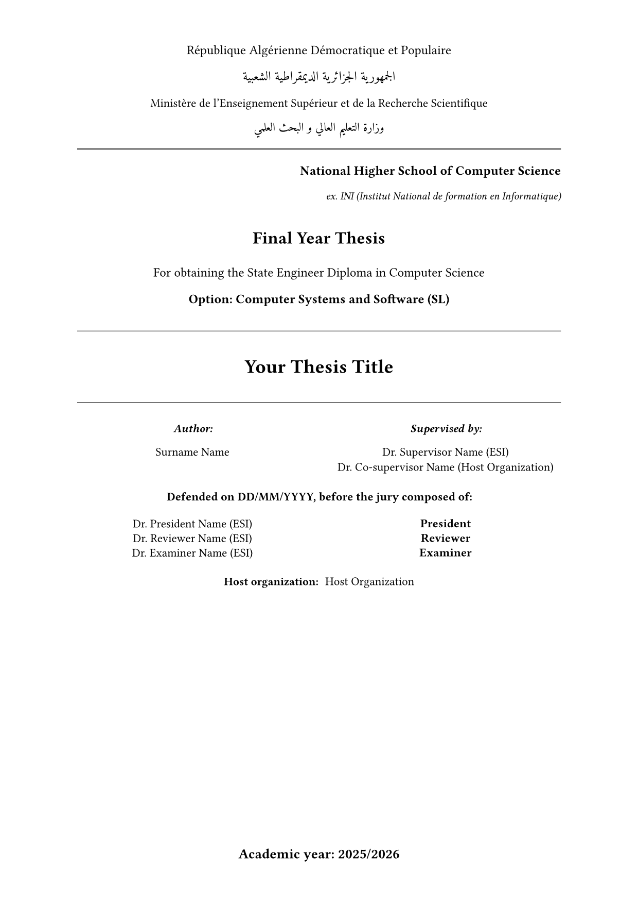

# esi-pfe

A [Typst](https://typst.app) template for the final-year project (PFE) thesis at
[ESI Algiers](https://www.esi.dz) (École nationale Supérieure d'Informatique), following
the school's formatting standards. It suits both State Engineer and Master theses.



## Features

- ESI cover page with the bilingual state header, supervisors, jury, and host organization
- Roman page numbers in the frontmatter, Arabic from the introduction onward
- Running header showing the current chapter or appendix
- Optional Part I / Part II dividers, with chapter numbering running continuously across parts
- English, French, and Arabic (RTL) abstract pages, plus dedication, acknowledgments, and abbreviations
- Table captions above tables, figure captions below; tables numbered per chapter (`Table 2.1`) and per appendix (`Table A.1`)
- Table, algorithm (via [lovelace](https://typst.app/universe/package/lovelace)), and code-block (via [zebraw](https://typst.app/universe/package/zebraw)) helpers

## Usage

With the Typst CLI:

```sh
typst init @preview/esi-pfe:0.1.0 my-thesis
cd my-thesis
typst watch main.typ
```

In the web app, choose **Start from template** and search for `esi-pfe`.

### Before it is on Typst Universe

Clone this repository into Typst's local package directory, then run the same `typst init`
command:

```sh
# Windows (PowerShell)
git clone https://github.com/Chamiln17/esi-pfe "$env:APPDATA\typst\packages\preview\esi-pfe\0.1.0"
# Linux
git clone https://github.com/Chamiln17/esi-pfe ~/.local/share/typst/packages/preview/esi-pfe/0.1.0
# macOS
git clone https://github.com/Chamiln17/esi-pfe ~/Library/Application\ Support/typst/packages/preview/esi-pfe/0.1.0
```

Fill in the metadata in `main.typ`, then write your chapters in `chapters/`. `main.typ` is the
only place that controls chapter order. To add a chapter, create a file and `#include` it there.

### Logo

The package does not ship the ESI logo. Download it from this repository
([`assets/esi_logo.png`](assets/esi_logo.png)) or from the school website, put it next to
`main.typ`, and set:

```typ
logo: image("esi_logo.png", width: 6cm),
```

### Fonts

The body text uses New Computer Modern, which Typst includes. The Arabic parts (cover header,
Arabic abstract) use [Amiri](https://fonts.google.com/specimen/Amiri). Install it on your system,
or put the font files in a folder and point Typst at it:

```sh
typst watch main.typ --font-path fonts/
```

### Structure

| Wrapper | Effect |
|---|---|
| `thesis.with(...)` | Cover page, then Roman page numbers for the frontmatter |
| `main_content[...]` | Resets to Arabic page numbers and adds the running header |
| `part_divider(label, title, summary)` | Full-page Part divider with its own PDF bookmark |
| `numbered_part[...]` | Nests the chapters it wraps under the preceding Part |
| `appendix_content[...]` | `A.1` heading numbering, tables reset per appendix |

Parts are optional. Without them, drop the `part_divider` calls and the `numbered_part`
wrappers and include the chapters directly inside `main_content`.

Label chapters `<ch:...>`, figures `<fig:...>`, and tables `<tab:...>`, and reference them
with `@label`. References to chapters render as "Chapter N".

## License

[MIT-0](LICENSE). You can use this template for your thesis without keeping any notice.
